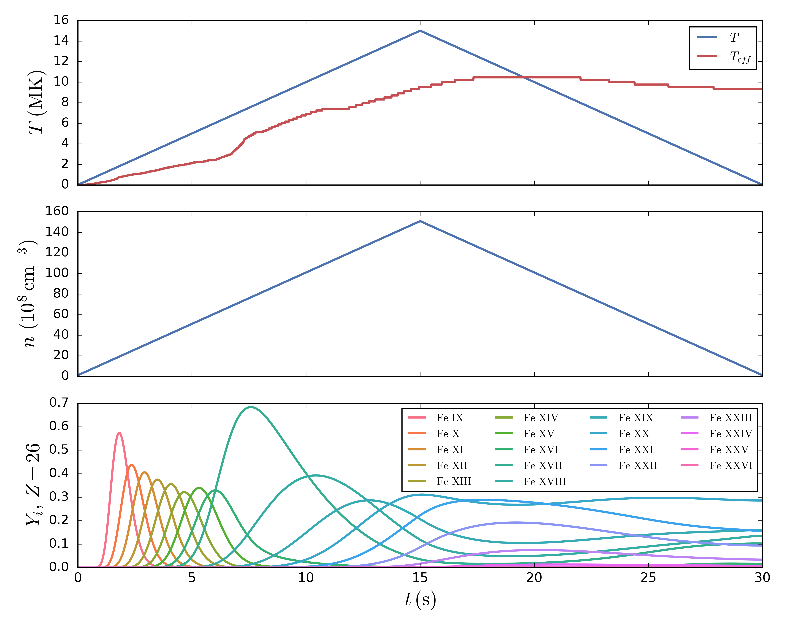

#IonPopSolver
IonPopSolver solves the time-dependent ionization equations for a particular element given tabulated values of the plasma electron temperature and density. These tabulated values can be the solutions of an analytical model, the output from a numerical simuation, or a set of observational measurements. A full description of the numerical model and relevant physics can be found in [Bradshaw (2009)](http://adsabs.harvard.edu/abs/2009A%26A...502..409B).

##Citation
If you use this code in a published work (e.g. paper, poster, presentation, etc.), please include the following citation for [Bradshaw (2009)](http://adsabs.harvard.edu/abs/2009A%26A...502..409B):
```
@ARTICLE{2009A&A...502..409B,
   author = {{Bradshaw}, S.~J.},
    title = "{A numerical tool for the calculation of non-equilibrium ionisation states in the solar corona and other astrophysical plasma environments}",
  journal = {\aap},
 keywords = {Sun: corona, Sun: UV radiation, atomic processes, methods: numerical},
     year = 2009,
    month = jul,
   volume = 502,
    pages = {409-418},
      doi = {10.1051/0004-6361/200810735},
   adsurl = {http://adsabs.harvard.edu/abs/2009A%26A...502..409B},
  adsnote = {Provided by the SAO/NASA Astrophysics Data System}
}
```

##Dependencies
IonPopSolver has been successfully tested and run on Mac OS X, Linux (Ubuntu 14.04), and Windows. It is recommended that Windows users use the Unix environment provided by <a href="https://www.cygwin.com/">Cygwin</a>. This will make installing the relevant dependencies and compiling the code much more simple. The following are required dependencies for compiling and running IonPopSolver:
 
<table>
  <tr>
    <th align="center" rowspan="2">Name</th>
    <th align="center" rowspan="2">Description</th>
	<th align="center" colspan="3">Installation</th>
  </tr>
  <tr>
    <th align="center">Mac OS X</th>
	<th align="center">Linux</th>
	<th align="center">Windows</th>
  </tr>
  <tr>
	  <td><a href="https://git-scm.com/">git</a></td>
	  <td>Version control system; for downloading and updating</td>
	  <td>included</td>
	  <td>included</td>
	  <td><a href="https://www.cygwin.com/">Cygwin</a></td>
  </tr>
  <tr>
	  <td><a href="http://scons.org/">SCons</a></td>
	  <td>Software construction tool; Pythonic alternative to Make</td>
	  <td><a href="https://www.macports.org/">Macports</a>, <a href="https://www.continuum.io/downloads">Anaconda</a>, <a href="http://scons.org/pages/download.html">tarball</a></td>
	  <td><tt>apt-get</tt>, <a href="https://www.continuum.io/downloads">Anaconda</a>, <a href="http://scons.org/pages/download.html">tarball</a></td>
	  <td><a href="https://www.cygwin.com/">Cygwin</a></td>
  </tr>
  <tr>
	  <td><a href="http://www.boost.org/">Boost Libraries</a></td>
	  <td>Open-source C++ libraries; used for command line parsing (the <tt>program_options</tt> module)</td>
	  <td><a href="https://www.macports.org/">Macports</a></td>
	  <td><tt>apt-get</tt></td>
	  <td>install from source (see below)</td>
  </tr>
</table>
 
### Installing Boost from Source
While Mac and Linux users can easily obtain the the Boost libraries from their respective package managers, Windows has no such equivalent (While Boost can be downloaded using the Cygwin package installer, building and linking has proved difficult). The best and simplest way for Windows users to acquire the Boost libraries is just to download the source code and build the one needed library, <tt>program_options</tt>.

+ First, download the Boost libraries tarball from [source](http://www.boost.org/users/history/version_1_55_0.html). Download the `.tar.gz` (we'll assume this is called `boost_1_55_0.tar.gz`) file for the Unix platform into a convenient directory `$DOWNLOADS`. 

+ Untar the compressed source (can take __several minutes__) and change into the uncompressed directory.
```Shell
    $ cd $DOWNLOADS
    $ tar xvzf boost_1_55_0.tar.gz
	$ cd boost_1_55_0
```

+ Next we need to configure the build of the `program_options` library. Make sure to include the `--with-libraries` flag. Run `./bootstrap.sh --help` if you want to see all available command line options.
```Shell
    $ ./bootstrap.sh --with-libraries=program_options`
```

+ Finally, we want to run the actual install script which has been generated by `./bootstrap.sh`. __This will take a long time, ~30 minutes.__ This will both build the `program_options` (static) library, move the library files to `/usr/local/lib` and the header files to `/usr/local/include`.
```Shell
    $ ./b2 link=static install
``` 

A more general summary of these instructions can be found [here](http://www.boost.org/doc/libs/1_55_0/more/getting_started/unix-variants.html).

##Downloading and Compiling
Change into the directory where you want to build the model (e.g. `$HOME`) and download IonPopSolver through the `git` command line utility by running
```Shell
    $ cd $HOME
    $ git clone --recursive https://github.com/rice-solar-physics/IonPopSolver.git
```
This will pull down a local copy of IonPopSolver at `$HOME/IonPopSolver`. The `--recursive` flag will automatically download and update the relevant submodules `$HOME/IonPopSolver/Radiation_Model/, $HOME/IonPopSolver/rsp_toolkit/, $HOME/IonPopSolver/rsp_toolkit/tinyxml2/`. To pull down any future updates to IonPopSolver, run `git pull` in `$HOME/IonPopSolver`.

To compile, run
```Shell
    $ scons
```
This will use the `$HOME/IonPopSolver/SConstruct` file to build an executable and place it in `$HOME/IonPopSolver/bin`. __Note:__ if `scons` fails because it cannot find the Boost libs or headers, you may need to adjust `CPPPATH` and `LIBPATH` in `$HOME/IonPopSolver/SConstruct`.

To clean up the object files and the executable, run `scons -c`. You can find more advanced SCons options by running `scons --help`.

##Getting the atomic data
The `Radiation_Model/` module used for calculating the ionization equation terms reads in tabulated values for the elemental balances, ionization and recombination rates, and temperature ranges for all ions for hydrogen (1) through nickel (28). A database of this atomic information has been compiled into a single repository, [`apolloDB`](https://github.com/rice-solar-physics/apolloDB). To download the atomic data to `$HOME/apolloDB`,
```Shell
    $ cd $HOME
    $ git clone https://github.com/rice-solar-physics/apolloDB.git
```

##Input and Output
IonPopSolver has five required arguments and one optional argument.

| Parameter | Description |
|:---------:|:------------|
| `-Z,--element` | Atomic number of element for which the ionization fractions are calculated. |
| `-f,--spec_from` | Spectroscopic number of starting ion |
| `-t,--spec_to` | Spectroscopic number of ending ion |
| `-I,--input_file` | File containing tabulated temperatures and densities |
| `-O,--output_file` | File containing effective temperature and ion population results |
| `-r,--rad_config` | Radiation model configuration file; optional, defaults to `test/radiation.example.cfg.xml` |

The input file, specified by the `-I` or `--input_file` flag, should contain the time _t_, the temperature, _T_, and the density _n_, each vectors of length _N_. IonPopSolver expects the file to be structured as follows:

<table style="float: center">
 <tr>
	  <td colspan="3"><i>N</i></td>
 </tr>
 <tr>
	  <td><i>t<sub>0</sub></i></td>
	  <td><i>T( t<sub>0</sub> )</i></td>
	  <td><i>n( t<sub>0</sub> )</i></td>
 </tr>
 <tr>
	 <td>...</td>
	 <td>...</td>
	 <td>...</td>
 </tr>
 <tr>
  <td><i>t<sub>i</sub></i></td>
  <td><i>T( t<sub>i</sub> )</i></td>
  <td><i>n( t<sub>i</sub> )</i></td>
 </tr>
 <tr>
	 <td>...</td>
	 <td>...</td>
	 <td>...</td>
 </tr>
 <tr>
  <td><i>t<sub>N-1</sub></i></td>
  <td><i>T( t<sub>N-1</sub> )</i></td>
  <td><i>n( t<sub>N-1</sub> )</i></td>
 </tr>
</table>

IonPopSolver outputs a results file to the path specified by `-O` or `--output_file` containing the time, temperature, effective temperature, and the ion population fractions, _Y_, for the element _Z_, for all ions between _s_ and _e_, the spectroscopic numbers specified by the `-f` and `-t` options, respectively. The output file is structured as follows:

<table style="float: center">
 <tr>
	  <td><i>t<sub>0</sub></i></td>
	  <td><i>T( t<sub>0</sub> )</i></td>
	  <td><i>T<sub>eff</sub>( t<sub>0</sub> )</i></td>
	  <td><i>n( t<sub>0</sub> )</i></td>
	  <td><i>Y<sub>Zs</sub>( t<sub>0</sub> )</i></td>
	  <td>...</td>
	  <td><i>Y<sub>Ze</sub>( t<sub>0</sub> )</i></td>
 </tr>
 <tr>
	 <td align="center" colspan="7">...</td>
 </tr>
 <tr>
  <td><i>t<sub>i</sub></i></td>
  <td><i>T( t<sub>i</sub> )</i></td>
  <td><i>T<sub>eff</sub>( t<sub>i</sub> )</i></td>
  <td><i>n( t<sub>i</sub> )</i></td>
  <td><i>Y<sub>Zs</sub>( t<sub>i</sub> )</i></td>
  <td>...</td>
  <td><i>Y<sub>Ze</sub>( t<sub>i</sub> )</i></td>
 </tr>
 <tr>
	 <td align="center" colspan="7">...</td>
 </tr>
 <tr>
  <td><i>t<sub>N-1</sub></i></td>
  <td><i>T( t<sub>N-1</sub> )</i></td>
  <td><i>T<sub>eff</sub>( t<sub>N-1</sub> )</i></td>
  <td><i>n( t<sub>N-1</sub> )</i></td>
  <td><i>Y<sub>Zs</sub>( t<sub>N-1</sub> )</i></td>
  <td>...</td>
  <td><i>Y<sub>Ze</sub>( t<sub>N-1</sub> )</i></td>
 </tr>
</table>

A sample radiation configuration file is provided in `test/radiation.example.cfg.xml`. This is an XML file that sets all of the options that go into the radiation model. Configure all of the elements that you want to include in the ion population fraction here. Additionally, setting the `cutoff_ion_fraction` field to something much higher (e.g. 1e-6 versus the default 1e-300) will speed up the calculation as all ion population fractions below this cutoff are ignored.  

__Note: The `atomicDB` field in the radiation configuration file must point at the directory where you installed the `apolloDB` repository. Using the example above, we would set `<atomicDB>$HOME/apolloDB/</atomicDB>`. The trailing slash must be included__.

##Example
`IonPopSolver/test` contains three example temperature and density profiles `IonPopSolver/test/Tt_nt_{1,2,3}.txt`. We will do a test with the input file `IonPopSolver/test/Tt_nt_1.txt`.

Change into `$HOME/IonPopSolver/`, clean the installation, and compile the code
```Shell
	$ cd $HOME/IonPopSolver
	$ scons -c
	scons: Reading SConscript files ...
	Using Mac OS X compile options.
	scons: done reading SConscript files.
	scons: Cleaning targets ...
	Removed Radiation_Model/source/OpticallyThick/OpticallyThickIon.o
	Removed Radiation_Model/source/element.o
	Removed Radiation_Model/source/ionfrac.o
	Removed Radiation_Model/source/radiation.o
	Removed rsp_toolkit/source/file.o
	Removed rsp_toolkit/source/fitpoly.o
	Removed rsp_toolkit/source/xmlreader.o
	Removed rsp_toolkit/tinyxml2/tinyxml2.o
	Removed source/main.o
	Removed bin/IonPopSolver.run
	scons: done cleaning targets.
	$ scons
	scons: Reading SConscript files ...
	Using Mac OS X compile options.
	scons: done reading SConscript files.
	scons: Building targets ...
	g++ -o Radiation_Model/source/OpticallyThick/OpticallyThickIon.o -c -g -O3 -fno-stack-protector -Wall -I/opt/local/include -I/usr/include/malloc Radiation_Model/source/OpticallyThick/OpticallyThickIon.cpp
	g++ -o Radiation_Model/source/element.o -c -g -O3 -fno-stack-protector -Wall -I/opt/local/include -I/usr/include/malloc Radiation_Model/source/element.cpp
	g++ -o Radiation_Model/source/ionfrac.o -c -g -O3 -fno-stack-protector -Wall -I/opt/local/include -I/usr/include/malloc Radiation_Model/source/ionfrac.cpp
	g++ -o Radiation_Model/source/radiation.o -c -g -O3 -fno-stack-protector -Wall -I/opt/local/include -I/usr/include/malloc Radiation_Model/source/radiation.cpp
	g++ -o rsp_toolkit/source/file.o -c -g -O3 -fno-stack-protector -Wall -I/opt/local/include -I/usr/include/malloc rsp_toolkit/source/file.cpp
	g++ -o rsp_toolkit/source/fitpoly.o -c -g -O3 -fno-stack-protector -Wall -I/opt/local/include -I/usr/include/malloc rsp_toolkit/source/fitpoly.cpp
	g++ -o rsp_toolkit/source/xmlreader.o -c -g -O3 -fno-stack-protector -Wall -I/opt/local/include -I/usr/include/malloc rsp_toolkit/source/xmlreader.cpp
	g++ -o rsp_toolkit/tinyxml2/tinyxml2.o -c -g -O3 -fno-stack-protector -Wall -I/opt/local/include -I/usr/include/malloc rsp_toolkit/tinyxml2/tinyxml2.cpp
	g++ -o source/main.o -c -g -O3 -fno-stack-protector -Wall -I/opt/local/include -I/usr/include/malloc source/main.cpp
	g++ -o bin/IonPopSolver.run Radiation_Model/source/element.o Radiation_Model/source/ionfrac.o Radiation_Model/source/radiation.o Radiation_Model/source/OpticallyThick/OpticallyThickIon.o rsp_toolkit/source/file.o rsp_toolkit/source/fitpoly.o rsp_toolkit/source/xmlreader.o rsp_toolkit/tinyxml2/tinyxml2.o source/main.o -L/opt/local/lib -lboost_program_options-mt
	scons: done building targets.
```

Next, run the code, calculating the population fractions of Fe for ions IX through XXVI.
```Shell
	$ bin/IonPopSolver.run -Z 26 -f 9 -t 26 -I test/Tt_nt_1.txt -O test/test1.out -r test/radiation.example.cfg.xml
	0%|         |100%
	  |||||||||||

	The process took 17.000000 seconds to run.
```

Now, using the simple python script `test/quick_plot.py`, we can plot the resulting temperature, density, effective temperature, and population fractions as a function of time and save it to the file `test/test1.png`.
```Shell
    $ python test/quick_plot.py -Z 26 -f 9 -t 26 -O test/test1.out --print_fig_filename test/test1
```

